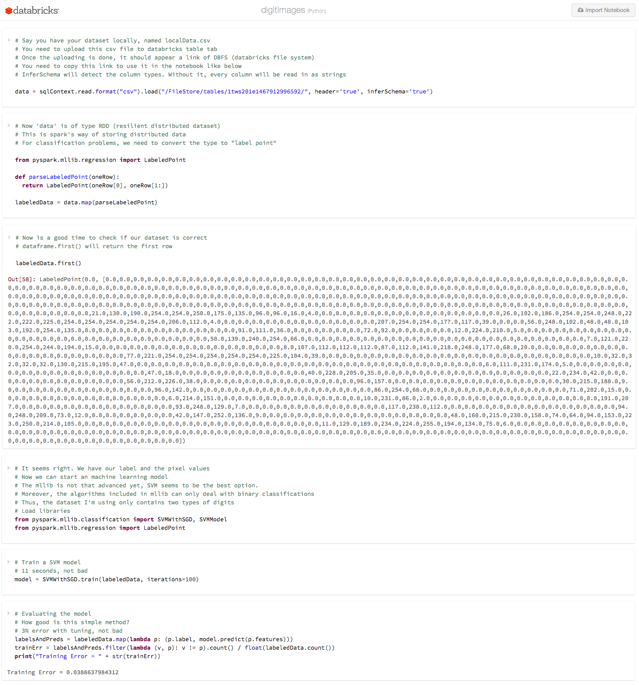

# hadoop-and-spark
Guide to use Hadoop with R and do machine learning problem with Spark

### 1. Hadoop Install
I use this [guide](https://getblueshift.com/setting-up-hadoop-2-4-and-pig-0-12-on-osx-locally/) to install Hadoop using homebrew. I use this [guide](http://zhongyaonan.com/hadoop-tutorial/setting-up-hadoop-2-6-on-mac-osx-yosemite.html) to learn how to browse the web interface for the NameNode and the ResourceManager. I use this [guide](http://blog.matthewrathbone.com/2013/04/17/what-is-hadoop.html) to understand the file system. I use this [guide](https://coderwall.com/p/imxf6g/running-wordcount-on-hadoop-using-r-script) to understand how Hadoop Streaming works.

### 2. Hadoop with R
**Test locally with bash pipes**

```
> cat tongueTwister
She sells sea-shells on the sea-shore.
The shells she sells are sea-shells, I'm sure.
For if she sells sea-shells on the sea-shore
Then I'm sure she sells sea-shore shells
```

```
> cat 'tongueTwister' | Rscript wcMapper.R | sort | Rscript wcReducer.R
are	1
for	1
if	1
im	2
on	2
seashells	3
seashore	3
sells	4
she	4
shells	2
sure	2
the	3
then	1

```
**Moving to hadoop**

```
> bin/hadoop dfs -put '/Users/Qiwei/Github/hadoop-and-spark/hadoop-with-R/tongueTwister' /tongueTwister
> bin/hadoop dfs -ls /
```

```
> hadoop jar /usr/local/Cellar/hadoop/2.7.2/contrib/streaming/hadoop-streaming-2.7.2.jar \ 
	-file /Users/Qiwei/Github/hadoop-and-spark/hadoop-with-R/wcMapper.R \ 
	-mapper "Rscript /Users/Qiwei/Github/hadoop-and-spark/hadoop-with-R/wcMapper.R" \ 
	-file /Users/Qiwei/Github/hadoop-and-spark/hadoop-with-R/wcReducer.R \ 
	-reducer "Rscript /Users/Qiwei/Github/hadoop-and-spark/hadoop-with-R/wcReducer.R" \ 
	-input /tongueTwister \ 
	-output /tongueTwisterOutput2
```

```
> bin/hadoop fs -cat /tongueTwisterOutput2/part-00000
are	1
for	1
if	1
im	2
on	2
seashells	3
seashore	3
sells	4
she	4
shells	2
sure	2
the	3
then	1

```
### 3. Spark on Databrick
Databricks is a cloud-based Spark platform. You can get 6GB of memory with databricks community edition. This is where I started my first machine learning projects with Spark.

Below is a screenshot of the python notebook. I explained

